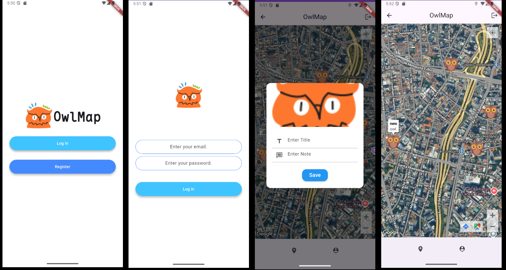

     

# owlmap
owlmap is a tracking app for bird sightings enthusiasts or any other thing you want.

# Development info

If you wish to work in the development of the app, during set up you must provide your Firebase and Google Maps connection API Key.

### Setting up the development environment
Clone this repository

`git clone https://github.com/inatagan/owlmap.git`

To work/build the flutter front-end, on the root of the repository navigate to:

`cd owlmap-flutter`

in this directory create the ".env" file, or a .json, to store the Google Map API key.

The you can run the the app with:

`flutter run --dart-define=<name_of_the_file>`

To build using the environment variables ue:

`flutter build apk --dart-define=<name_of_the_file>`